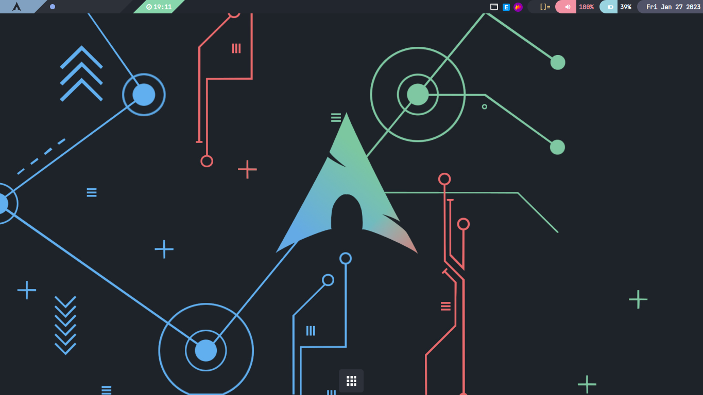
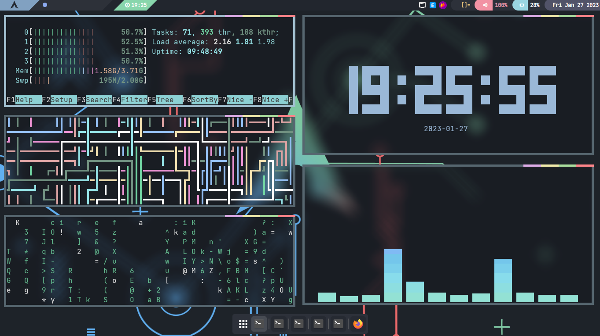

# Preview


# Setup
```
sudo pacman -S awesome rofi starship pamixer acpi git flameshot polkit-gnome
```
# Install 
```
git clone https://github.com/haobtjs/dotfiles
cd dotfiles
cd home && cp -a ./ ~/ && cd ..
cd bin && sudo cp -a ./ /bin && cd ..
sudo pacman -U ./packages/picom-animations-git/picom-animations-git-1770_Next.208.g51b2135_2022.05.29-1-x86_64.pkg.tar.zst
#or run :cd packages/picom-animations-git && makepkg -sic && cd ../../
sudo pacman -U ./packages/i3lock-color/i3lock-color-2.13.c.4-1-x86_64.pkg.tar.zst
#or run : cd packages/i3lock-color && makepkg -sic && cd ../../
tar -xf papirus-nordic.tar.xz -C ~/.icons/
```
# Some shortcut
`Super` + `Enter` : open terminal <br>
`Super` + `f` : open browser <br>
`Super` + `e` : open file manager <br>
`Super` + `r` : open apps <br>
`Super` + `Shift` + `r` : open launcher <br>
`Super` + `x` : open powermenu <br>
`Super` + `d` : show/hide dock  <br>
`Super` + `s` : show shortcut